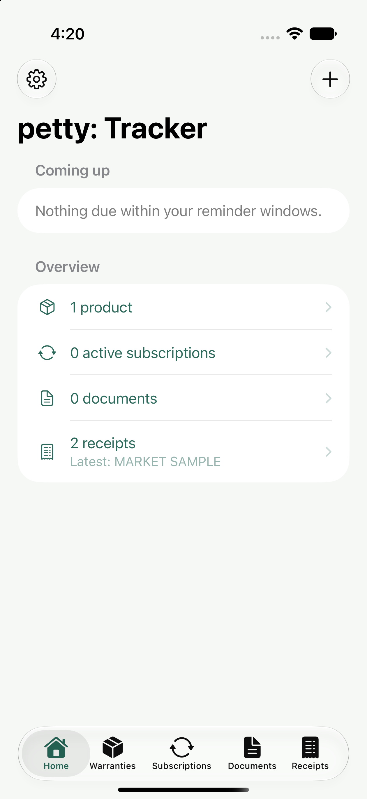
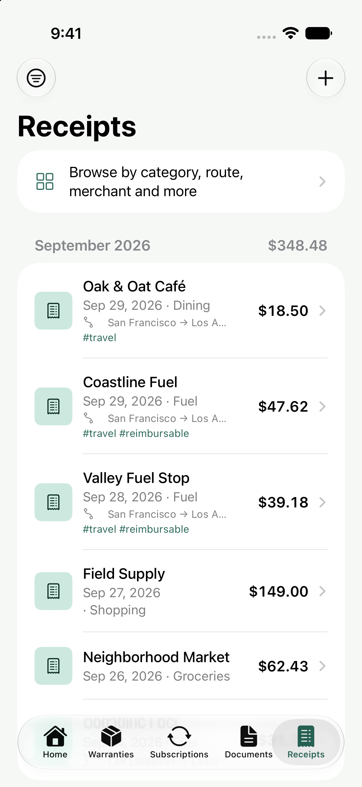
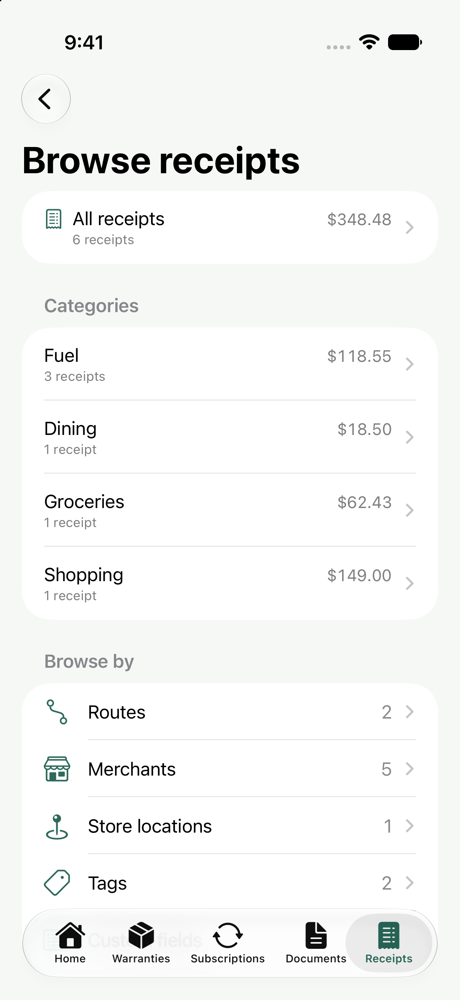
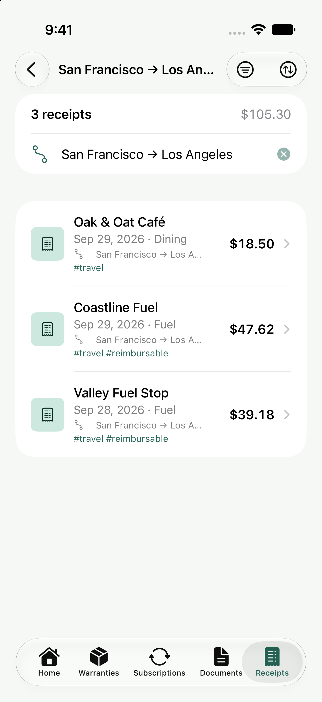

<p align="center">
  
</p>

<h1 align="center">petty: Tracker</h1>

<p align="center"><strong>Your receipts, warranties, subscriptions, and important dates. In one place.</strong></p>

<p align="center">
  <a href="LICENSE"></a>
  
  
  
</p>

petty: Tracker is a free, open source app for iOS and Android that helps you keep the paperwork behind everyday purchases organized. Keep proof of purchase beside the product it belongs to, and get reminders before a warranty ends, a subscription renews, or a document expires. On iOS, scan and itemize receipts, then find them later by merchant, category, trip, or your own custom fields.

Records stay on your device, and iOS receipt recognition runs on the iPhone. No account, ads, analytics, paid subscriptions, or paid feature tiers.

**[Build the apps](#build-and-run)** · **[iOS guide](ios/README.md)** · **[Android guide](android/README.md)** · **[Report a bug](https://github.com/petty-foss-dev/Petty-Tracker/issues/new/choose)**

Both native apps live in this repository: `ios/` uses SwiftUI and `android/` uses Kotlin and Jetpack Compose. Their original Git histories are preserved.

## A look inside

Real iOS screenshots from the iPhone Air simulator, using fictional demo records.

<table>
  <tr>
    <th>Stay ahead of important dates</th>
    <th>Keep receipts together</th>
  </tr>
  <tr>
    <td></td>
    <td></td>
  </tr>
  <tr>
    <th>Browse by what matters to you</th>
    <th>Find the receipts for a trip</th>
  </tr>
  <tr>
    <td></td>
    <td></td>
  </tr>
</table>

[View a receipt's store, payment, trip, and fuel details](docs/screenshots/details.png).

## Platform support

| Feature | iOS | Android |
| --- | --- | --- |
| Warranties, subscriptions, documents, and attachments | Yes | Yes |
| Search, local reminders, themes, and ZIP backups | Yes | Yes |
| Receipt scanning, OCR, and itemization | Yes | — |
| Receipt categories, routes, custom fields, and review inbox | Yes | — |
| Receipt CSV and warranty claim PDF exports | Yes | — |
| Receipt Share extension and Scan Receipt App Intent | Yes | — |

Android can attach receipt images or PDFs to products; it does not scan or itemize them.

## What you can do on iOS

| Area | Features |
| --- | --- |
| **Scan receipts** | Document camera, Photos, Files, and PDF import. Apple Vision recognizes text on the device. Keep the original pages and edit the extracted details. |
| **Itemize purchases** | Merchant, date and time, items and quantities, discounts, subtotal, tax, tip, and total. Read printed store, transaction, payment, and fuel details when the text clearly supports them. |
| **Find and organize** | Categories, tags, store locations, trip endpoints, and any number of custom fields. Search the fields and original OCR text, combine filters, and see totals in each currency. |
| **Review scans** | Find missing fields, unreadable pages, inconsistent totals, identical scans, and possible duplicates in the review inbox. |
| **Keep warranties** | Product details, serial numbers, warranty dates, attachments, and linked receipts. Create a product from a receipt item and export a warranty claim PDF. |
| **Track recurring costs** | Flexible subscription cycles, renewal dates, cancellation, and local reminders. |
| **Remember document dates** | Issuer, reference number, issue and expiry dates, notes, and attachments. |
| **Capture and export** | Share images and PDFs into petty: Tracker, use the Scan Receipt App Intent, export the current receipt results as CSV, or back up records and attachments to a ZIP. |

For example, open **Receipts → Browse → Fuel**, narrow by a route, then add **Vehicle = Civic** or a date range. Export just those matching receipts for a trip or reimbursement.

OCR can make mistakes, especially with handwriting. Every extracted field is editable; missing details stay blank. Trip endpoints and custom fields are entered by you. The document camera requires a physical iPhone. PDF imports support up to 20 pages per file, and the share extension accepts up to 20 files at a time.

## Privacy and backups

The iOS app makes no network requests, and the Android app does not request Internet permission. Your records and attachments live in local storage; Apple Vision processes iOS receipt images on the device. Files shared into iOS wait in the app's local shared inbox until you save or discard them.

**Export backups regularly.** Records and attachments are excluded from automatic cloud backups on both platforms and from Android device-to-device transfer. You choose when to share a file or export a ZIP backup.

Backups without receipts use the shared version 1 format. Receipt backups use version 3 and can be restored by current iOS builds. Existing version 2 iOS backups still import. Android does not currently support receipts and rejects receipt backups. See the [backup reference](docs/ios-reference.md#backup-format) for details.

## Build and run

The source for both apps is available now. There are currently no packaged releases in this repository; build from source to try them.

```sh
git clone https://github.com/petty-foss-dev/Petty-Tracker.git
cd Petty-Tracker
```

### iOS

You need a Mac with **Xcode 26 or later** and **[XcodeGen](https://github.com/yonaskolb/XcodeGen)**. The deployment target is **iOS 17.0**. Swift Package Manager resolves the pinned ZIPFoundation dependency.

```sh
cd ios
xcodegen generate
open EnveKeep.xcodeproj
```

Choose the **EnveKeep** scheme and an iPhone simulator, then run. Simulator receipt capture supports Photos, Files, and manual entry.

To build and test from Terminal with an installed iPhone Air simulator:

```sh
xcodebuild -project EnveKeep.xcodeproj -scheme EnveKeep \
  -destination 'platform=iOS Simulator,name=iPhone Air' \
  CODE_SIGNING_ALLOWED=NO build test
```

For a physical iPhone, select your development team for both **EnveKeep** and **EnveKeepShare**. The targets use `com.enve.keep`, `com.enve.keep.share`, and the shared App Group `group.com.enve.keep`. Your signing setup must support these identifiers. If you use your own identifiers, update both targets and entitlements in `project.yml`, and the App Group value in `Shared/SharedInbox.swift`, then regenerate the project.

The latest feature verification passed **135 tests on iOS 17 and iOS 27 simulators**, with no build warnings. Route and custom field browsing, CSV sharing, claim PDF preview, and the Photos share extension were exercised in Simulator. Camera capture, handwriting on real receipts, and Shortcut discovery still need physical iPhone verification.

### Android

Use **JDK 17 or later**, the Android SDK with **compile SDK 36.1**, and Android Studio or the included Gradle wrapper. The minimum is **Android 8.0 (API 26)**. Run these commands from the repository root:

```sh
cd android
export ANDROID_HOME=/path/to/Android/sdk
./gradlew :app:assembleDebug :app:testDebugUnitTest
```

The debug APK is written to `android/app/build/outputs/apk/debug/app-debug.apk`. With an Android device connected, run `./gradlew :app:installDebug` from `android/`. The combined checkout builds without warnings and passes **18 Android unit tests**. The debug app was installed and its Settings screen checked on a Pixel 7a. See the [Android guide](android/README.md) for its features and project layout.

### Repository layout

| Folder | Contents |
| --- | --- |
| `ios/` | SwiftUI app, Share extension, XcodeGen project, and iOS tests |
| `android/` | Compose app, Gradle wrapper, Room schemas, and Android tests |
| `docs/` | Feature and backup reference, screenshots, and dependency licenses |
| `.github/` | Issue forms, pull request template, and Sponsor configuration |

## Contribute

Bug reports, accessibility improvements, documentation, and focused pull requests are welcome. Start with [CONTRIBUTING.md](CONTRIBUTING.md). Please use fictional or redacted receipts in issues and screenshots.

The [iOS feature and backup reference](docs/ios-reference.md) explains the receipt data format. Platform build details live beside each app. The former separate platform repositories have been superseded by this combined repository.

## License

petty: Tracker's original source is licensed under the **GNU Affero General Public License v3.0 only** (`AGPL-3.0-only`). See [LICENSE](LICENSE) and [NOTICE.md](NOTICE.md).

Third-party components retain their own licenses. The iOS and Android dependency notices are in [THIRD_PARTY_NOTICES.md](THIRD_PARTY_NOTICES.md).
